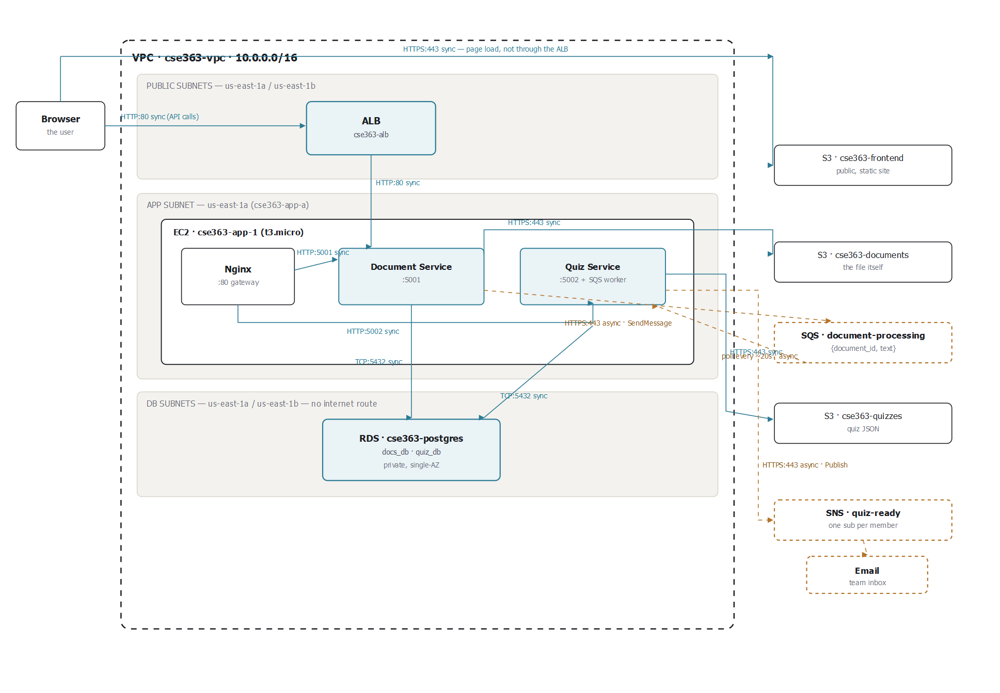

# CSE363 Milestone 1 — Infrastructure Report

Region: **us-east-1** (N. Virginia). All resources below were built or verified in this region.

## Architecture diagram



Every arrow is labelled with its protocol and port, and marked **sync** (the caller blocks waiting for a response) or **async** (fire-and-forget, decoupled by SQS/SNS). Full-resolution vector source: [`docs/architecture.svg`](docs/architecture.svg).

## 1. Deviations from the spec (and why)

| Spec value | Actual value | Reason |
|---|---|---|
| EC2 instance type `t2.micro` | `t3.micro` | This AWS account's free-tier eligibility list (`ec2:DescribeInstanceTypes --filters free-tier-eligible=true`) does not include `t2.micro`; it includes `t3.micro`, `t3.small`, `t4g.micro`, `t4g.small`. `t3.micro` is the direct equivalent (2 vCPU, 1 GiB RAM) and is free-tier eligible on this account. |
| PostgreSQL "current default version" | Engine version `18.3` | Left `--engine-version` unspecified as instructed; RDS selected its current default for the `postgres` engine, which resolved to 18.3. |

Everything else was built exactly to spec.

## 2. Access-control matrix

| Component | Documents bucket | Quizzes bucket | Frontend bucket | `docs_db` | `quiz_db` | SQS queue | SNS topic |
|---|---|---|---|---|---|---|---|
| Document Service | Read/write | None | None | Read/write | None | Send | None |
| Quiz Service / Worker | None | Read/write | None | None | Read/write | Receive/delete | Publish |
| Nginx Gateway | None | None | None | None | None | None | None |
| Browser/frontend | None | None | Public read | None | None | None | None |

The EC2 instance role (`CSE363-EC2-Role`) enforces every cell of this matrix through four narrow inline policies: `DocumentServiceS3Policy` (`cse363-documents` only), `QuizServiceS3Policy` (`cse363-quizzes` only), and `SqsSnsAppAccess` (send/receive/delete on the `document-processing` queue, publish on the `quiz-ready` topic only). There is no policy statement anywhere that gives either service's code a path to the other's bucket or database — the isolation in this table is enforced by IAM, not just by convention.

## 3. RDS shared-instance compromise — what it does and doesn't protect against

> To reduce project cost, the two service databases are hosted on one PostgreSQL RDS instance while using separate databases and separate service credentials. This protects against ordinary cross-service access because each service user is granted access only to its own database. However, it does not provide full infrastructure isolation. An RDS instance failure, maintenance event, resource-exhaustion problem, master-administrator compromise, or instance-level security issue can affect both databases. Separate RDS instances would provide stronger fault, resource and administrative isolation, but at a higher cost.

This is demonstrated concretely in [evidence/rds-database-isolation-proof.txt](evidence/rds-database-isolation-proof.txt): `quiz_user` is cryptographically/authorization-denied from `docs_db` at the database-connect level (`FATAL: permission denied for database "docs_db"`), but both databases still share the same underlying compute, storage, and master credential.

## 4. Built infrastructure summary

**Networking** — `cse363-vpc` (`10.0.0.0/16`, DNS support + hostnames enabled), six subnets across `us-east-1a`/`us-east-1b`, `cse363-igw` attached, three route tables, correct subnet associations. No NAT Gateway, no Transit Gateway, no VPN — per the spec's own cost guidance, a NAT Gateway is explicitly not required, so the app tier reaches the internet (for `docker pull`, S3, SQS/SNS, SSM) via a direct IGW route on `cse363-app-rt` instead. The real isolation boundary is the DB tier, which has no internet route at all, plus the security-group chain below — not the app subnet's route table.

**Subnet allocation table**

| Subnet | AZ | CIDR | Tier | Internet route |
|---|---|---|---|---|
| `cse363-public-a` | us-east-1a | `10.0.1.0/24` | Public | `0.0.0.0/0` → IGW |
| `cse363-public-b` | us-east-1b | `10.0.2.0/24` | Public | `0.0.0.0/0` → IGW |
| `cse363-app-a` | us-east-1a | `10.0.11.0/24` | App | `0.0.0.0/0` → IGW |
| `cse363-app-b` | us-east-1b | `10.0.12.0/24` | App | `0.0.0.0/0` → IGW |
| `cse363-db-a` | us-east-1a | `10.0.21.0/24` | DB | None — local (`10.0.0.0/16`) only |
| `cse363-db-b` | us-east-1b | `10.0.22.0/24` | DB | None — local (`10.0.0.0/16`) only |

**Security groups** — `CSE363-ALB-SG` → `CSE363-App-SG` → `CSE363-DB-SG`, chained so no tier accepts a raw CIDR rule from anything but the tier in front of it. Verified live via `describe-security-groups`, including egress (not just inbound).

**Security group table**

| Security group | Direction | Port | Protocol | Source / destination |
|---|---|---|---|---|
| `CSE363-ALB-SG` | Inbound | 80 | TCP | `0.0.0.0/0` |
| `CSE363-ALB-SG` | Outbound | 80 | TCP | `CSE363-App-SG` |
| `CSE363-App-SG` | Inbound | 80 | TCP | `CSE363-ALB-SG` |
| `CSE363-App-SG` | Inbound | 22 | TCP | `154.180.239.247/32` (operator IP only) |
| `CSE363-App-SG` | Outbound | All | All | `0.0.0.0/0` |
| `CSE363-DB-SG` | Inbound | 5432 | TCP | `CSE363-App-SG` |
| `CSE363-DB-SG` | Outbound | All | All | `0.0.0.0/0` |

**IAM** — `CSE363-EC2-Role` with instance profile, trust policy scoped to `ec2.amazonaws.com`, two inline policies (`DocumentServiceS3Policy`, `QuizServiceS3Policy`) each scoped to one bucket, plus AWS-managed `AmazonSSMManagedInstanceCore` (added so this session could run remote commands via SSM instead of opening broader SSH access — a stronger security posture than routing everything through port 22). No broad policies (`AdministratorAccess`, `S3FullAccess`, etc.) attached.

**Compute** — `cse363-app-1` (`i-00563b8d3747b28fc`), Amazon Linux 2023, `t3.micro`, in `cse363-app-a`, `CSE363-App-SG`, 8 GiB gp3, IMDSv2 required with hop limit 2, nginx placeholder page + `/health` via user-data. Verified from inside the instance: `curl /` → 200, `curl /health` → `OK`, and `aws sts get-caller-identity` → `arn:aws:sts::339879234587:assumed-role/CSE363-EC2-Role/i-00563b8d3747b28fc` (proves temporary role credentials, no static keys). See [evidence/ec2-nginx-and-role-verification.txt](evidence/ec2-nginx-and-role-verification.txt).

**Load balancing** — `cse363-nginx-tg` (HTTP:80, health path `/health`, 200, 2/2 thresholds, 5s timeout, 30s interval) with `cse363-app-1` registered and **healthy**. `cse363-alb` (internet-facing, both public subnets, `CSE363-ALB-SG`), HTTP:80 listener forwarding to the target group. Verified externally: `http://cse363-alb-614549833.us-east-1.elb.amazonaws.com/` and `/health` both return 200 from outside the VPC.

**Database** — `cse363-db-subnet-group` (both DB subnets), `cse363-postgres`: PostgreSQL 18.3, `db.t3.micro`, 20 GiB gp3, Single-AZ, **not** publicly accessible, `CSE363-DB-SG`, port 5432, backup retention 1 day, no Performance Insights/Enhanced Monitoring/deletion protection. `docs_db`/`quiz_db` created, `docs_user`/`quiz_user` created, `PUBLIC` revoked from both databases, each user granted exclusively on its own database plus `USAGE, CREATE` on its own `public` schema (prep for Milestone 2 table creation). Isolation proven — see [evidence/rds-database-isolation-proof.txt](evidence/rds-database-isolation-proof.txt).

**S3** (built earlier, reverified here) — `cse363-documents` and `cse363-quizzes` both have versioning **Enabled** and Block Public Access fully **On** (all four settings true).

Credentials (RDS master password, `docs_user`/`quiz_user` passwords) live only in `secrets/db-credentials.txt`, which is git-ignored and must never be committed, screenshotted, or pasted into this report.

## 5. Milestone 1 acceptance checklist

- [x] VPC is `10.0.0.0/16`
- [x] Six subnets exist across two AZs
- [x] Internet Gateway is attached
- [x] Database subnets have no internet route
- [x] No NAT Gateway exists
- [x] ALB-SG accepts public HTTP
- [x] App-SG accepts HTTP only from ALB-SG
- [x] DB-SG accepts PostgreSQL only from App-SG
- [x] EC2 runs in an app subnet
- [x] EC2 has CSE363-EC2-Role
- [x] `/health` returns HTTP 200
- [x] ALB target is Healthy
- [x] Placeholder page loads through ALB DNS
- [x] Three S3 buckets exist
- [x] Documents and quizzes have versioning
- [x] Private buckets block public access
- [x] IAM policies are scoped to individual buckets
- [x] RDS is private and Single-AZ
- [x] `docs_db` and `quiz_db` exist
- [x] `docs_user` and `quiz_user` exist
- [x] `quiz_user` is denied access to `docs_db`
- [x] `$5` monthly budget alert exists (completed earlier by user)

All 22 items pass. Every §17 checklist item is captured as verifiable CLI command output in [evidence/cli-evidence-pack.md](evidence/cli-evidence-pack.md), organized under the same section headings (VPC, Security groups and ALB, S3, IAM, RDS) as the spec's own screenshot checklist — usable directly in place of, or alongside, console screenshots.

---

# Milestone 2 — Services & Containers

## 6. What was built

Three containers, deployed and running on `cse363-app-1` behind `cse363-alb`, replacing the Milestone 1 placeholder page entirely:

- **`document-service`** (Flask, `:5001`) — `POST /api/documents/upload`, `GET /api/documents`, `GET /api/documents/{id}`, `GET /health`. Stores the file in `cse363-documents`, extracts text (`pypdf` for PDF, raw decode for text), writes a row to `docs_db`, sends `{document_id, text}` to the `document-processing` SQS queue, returns `202` without waiting on anything downstream.
- **`quiz-service`** (Flask + a background worker thread in the same container, per the spec's own repo layout) — `GET /api/quiz/{id}`, `POST /api/quiz/{id}/submit`, `GET /health`. The worker (`worker.py`) long-polls SQS, runs a rule-based quiz generator (`quizgen.py` — blanks a number or capitalised term per sentence, offers up to three distractors), stores the quiz JSON in `cse363-quizzes`, writes metadata to `quiz_db`, and publishes to the `quiz-ready` SNS topic.
- **`gateway`** (Nginx) — the only container the ALB target group points at. Routes `/api/documents/*` and `/api/quiz/*` by path, answers `/health` directly, and adds CORS headers so the S3-hosted `frontend/index.html` can call it cross-origin.

Full code: [`document-service/`](document-service/), [`quiz-service/`](quiz-service/), [`gateway/`](gateway/). Architecture diagram and rationale: [`docs/architecture.md`](docs/architecture.md) / [`docs/architecture.png`](docs/architecture.png). Full API reference: [`docs/api.md`](docs/api.md).

## 7. New AWS resources this milestone

| Resource | Value |
|---|---|
| SQS queue | `document-processing` — `arn:aws:sqs:us-east-1:339879234587:document-processing` |
| SNS topic | `quiz-ready` — `arn:aws:sns:us-east-1:339879234587:quiz-ready`, one email subscription (pending the recipient's confirmation click) |
| IAM | New inline policy `SqsSnsAppAccess` on `CSE363-EC2-Role`: send/receive/delete scoped to the one queue ARN, publish scoped to the one topic ARN — no wildcard resources |

Docker Engine 25 and the Compose v5 / Buildx plugins were installed on `cse363-app-1` (not present on the base Amazon Linux 2023 image); the M1 host-level `nginx` (placeholder page) was stopped and disabled so the `gateway` container could bind port 80.

## 8. Two real bugs this milestone's testing caught

Both are detailed with full log evidence in [evidence/milestone2-e2e-evidence.md](evidence/milestone2-e2e-evidence.md):

1. **A DDL race condition.** `quiz-service` runs `CREATE TABLE IF NOT EXISTS` from two independent processes at startup (the gunicorn API and the worker thread's process). Postgres does not make that safe under true concurrency — first boot threw `psycopg2.errors.UniqueViolation` on the system catalog, and Docker's restart policy silently retried it into a passing state. Fixed with a `pg_advisory_lock` around schema creation in all three entry points that call it.
2. **Stale upstream DNS in Nginx.** `proxy_pass` to a bare hostname resolves once at worker startup and caches the IP forever. Rebuilding `document-service`/`quiz-service` without touching `gateway` left Nginx pointed at dead container IPs (`502` on every `/api/` route) until `gateway` itself restarted. Fixed by adding Docker's embedded DNS resolver (`127.0.0.11`, 10s TTL) with `proxy_pass` through a variable, so it re-resolves instead of caching.

Neither would have been caught by only checking that the containers show `healthy` — both required an actual request through the real ALB.

## 9. Milestone 2 acceptance checklist

- [x] Document Service: upload → S3 → text extraction → `docs_db` (live-tested through the ALB, not localhost)
- [x] Quiz Service: generates, serves, and scores a quiz (5 questions from a 9-sentence sample; both partial and perfect scores tested)
- [x] Dockerfile + `/health` for all three services, `docker compose ps` shows all `healthy`
- [x] `docker compose up -d --build` runs the whole stack from one command
- [x] Nginx gateway routes both `/api/documents/*` and `/api/quiz/*` correctly, verified with `curl` through the ALB
- [x] No credential anywhere in the repository or a Docker image — scanned and confirmed, see §10
- [x] Services never touch each other's storage — enforced by IAM (§6 access-control matrix), not just convention

Full request/response evidence for every item: [evidence/milestone2-e2e-evidence.md](evidence/milestone2-e2e-evidence.md).

## 10. Credential hygiene (the automatic −2 deduction item)

`.env` was never created inside the repository — it exists only on `cse363-app-1`, written directly via SSM into the container host, `chmod 600`. Verified before considering this milestone complete:

```
$ ls .env                     → No such file or directory (correct — it must not exist here)
$ grep -rniE "AKIA[0-9A-Z]{16}|password\s*=\s*['\"][^'\"]{3,}['\"]|BEGIN (RSA|OPENSSH) PRIVATE KEY" \
    --include="*.py" --include="*.yml" --include="*.conf" --include="*.md" --include="*.sql" --include="*.json" .
                               → no matches
$ grep -n "\.env" .gitignore
8:.env
9:.env.*
10:!.env.example
```

The Dockerfiles only ever `COPY` source files (`app.py`, `requirements.txt`, `nginx.conf`, …) — never `.env` — so the images themselves are clean regardless of what's on the host.

## 11. Frontend deployed and verified live, over HTTPS

`frontend/index.html` is uploaded to `cse363-frontend`. The S3 static-website endpoint (`http://cse363-frontend.s3-website-us-east-1.amazonaws.com`) works, but S3 website endpoints don't support TLS at all — any browser that upgrades a bare or typed `https://` address (which is now the default in Chrome/Firefox) gets a hung connection with no obvious explanation.

**Fix: two CloudFront distributions**, both using CloudFront's default `*.cloudfront.net` certificate (no ACM, no custom domain needed):

| Distribution | Origin | Purpose |
|---|---|---|
| `E3GLSKY91XBF83` → `https://dmy1etit3nbyw.cloudfront.net` | `cse363-frontend` S3 website endpoint (HTTP-only origin) | The site itself |
| `E2I6O68M6XKECA` → `https://d3fbanu3k36721.cloudfront.net` | `cse363-alb` (HTTP-only origin) | HTTPS front door for the API |

The second distribution exists because of a real bug the first one introduced: once the frontend loads over HTTPS, its `fetch()` calls to the plain-HTTP ALB get silently blocked by the browser as **mixed content** (confirmed directly — `Mixed Content: ... This request has been blocked; the content must be served over HTTPS`, and the page failed with "Could not load documents: Failed to fetch"). `frontend/index.html`'s `API_BASE` now points at the HTTPS API distribution instead of the ALB directly. Both distributions use the `CachingDisabled` managed cache policy so edits and API responses are never stale.

Verified on a clean browser tab against the final HTTPS URL, not just `curl`: page loaded, document list populated via a cross-origin HTTPS fetch, quiz loaded, answers submitted, score (`1 / 5 correct`) rendered — zero console errors.

This needed two narrowly-scoped additions to the CLI operator policy: `FrontendBucketDeploy` (`s3:PutObject` + `s3:ListBucket`, resource-locked to `cse363-frontend`) and `CloudFrontFrontendCdn` (six `cloudfront:*` actions needed to create/manage distributions — CloudFront resources don't exist yet at policy-write time, so this one can't be resource-scoped to a specific ARN the way the others are). `CSE363-EC2-Role` still has no access to the frontend bucket, matching the access-control matrix in §2.

Tested as a real user would use it, not just via `curl`: loaded the page from S3, confirmed it pulled the document list cross-origin from the ALB (proving the gateway's CORS headers work), opened the quiz for a previously-uploaded document, selected answers through the actual radio-button UI, submitted, and got back `2 / 5 correct` — matching the answers actually selected. Full request path exercised: browser → S3 (page load) → browser → ALB → Nginx → Quiz Service → `quiz_db` (score) and → S3 (`cse363-quizzes`, quiz JSON) → back to the browser.

## 12. Why each AWS service is here, and what breaks without it

**VPC** — the isolation boundary everything else depends on. Without it, there is no private address space to put subnets, security groups, or a database in at all; every resource would need to live in the shared default VPC with none of the tiering below possible.

**Subnets + route tables** — the mechanism that actually makes "public" and "private" real, not just a label. Remove the DB subnets' lack of an internet route and `cse363-postgres` becomes reachable from the open internet the moment anyone (accidentally or otherwise) opens the security group. The tiering is what turns a security-group mistake into a non-event instead of a breach.

**Security groups (chained)** — the actual enforcement of the project's one rule. Without ALB-SG → App-SG → DB-SG chaining, we'd be back to CIDR-range rules, and the Quiz Service container would need *some* rule letting it reach 5432 — at which point nothing technical stops it from also reaching `docs_db`. The chain is what makes "services can't touch each other's data" a property of the network, not a promise in the code.

**EC2** — the compute `docker compose` actually runs on. Without it there's nowhere for the three containers to live; this project deliberately doesn't use Fargate for the base implementation (that's bonus scope) specifically to keep the Docker/Compose fundamentals front and center.

**IAM** — the reason no AWS access key exists anywhere in this repository. Without an instance role, the containers would need long-lived credentials baked into the image or the `.env` file — exactly the failure mode that costs 2 automatic marks. The role is what lets `boto3` "just work" with zero secrets involved.

**S3** — the durable storage for both the uploaded files and the generated quizzes. Containers are ephemeral by design (a redeploy wipes them); without S3, an upload would vanish the moment its container restarted. Versioning on the documents/quizzes buckets also means an accidental overwrite is recoverable, not permanent.

**RDS** — durable, queryable state for metadata, extracted text, and scores — the things S3's flat object model can't do well (filtering, relationships, transactional writes). Without it, "list my documents" or "here's your score" would need to be reconstructed from S3 listings on every request.

**ALB** — the single stable public address and the health-check mechanism. Without it, the frontend would need to know the EC2 instance's IP directly, and a container crash would mean total downtime instead of the target group simply routing around it (once more than one instance exists).

**SQS** — the decoupling mechanism this whole project is built to demonstrate. Without it, `POST /api/documents/upload` would have to synchronously generate a quiz before responding — turning a sub-second upload into a multi-second wait, and making the Document Service's response time hostage to the Quiz Service's. Proven directly in [evidence/milestone3-resilience-proof.md](evidence/milestone3-resilience-proof.md): the Quiz Service was fully down and uploads kept working without any degradation.

**SNS** — the notification fan-out. Without it, the Quiz Service's worker would need its own SMTP client, its own list of who to email, and its own retry logic for a concern that has nothing to do with generating quizzes. SNS turns "notify someone" into one API call and lets the *subscriber list* change without touching a single line of application code.

**CloudFront** — not originally planned, added when a real bug (mixed-content blocking) demanded it. Without it, the frontend can only be used over plain HTTP, which every modern browser actively fights by default. It's also worth noting what CloudFront does *not* protect against: it doesn't encrypt the CloudFront→origin hop (that's plain HTTP internally, which is fine only because that hop never leaves AWS's own network).

**AWS Budgets** — the only thing standing between "small class project" and a genuinely large bill if something is left running by mistake. It doesn't prevent overspend — it can only alert after the fact — but for a project this size, the alert is enough lead time to act.

## 13. Milestone 3 — Integration, Resilience, Documentation

### End-to-end async flow

Already demonstrated live and logged in [evidence/milestone2-e2e-evidence.md](evidence/milestone2-e2e-evidence.md) and reconfirmed during the resilience test below: upload → SQS → worker → quiz stored → served → scored, entirely through the public ALB/CloudFront endpoints, no shortcuts.

### Resilience demo

Full transcript in [evidence/milestone3-resilience-proof.md](evidence/milestone3-resilience-proof.md). Summary: `quiz-service` (the worker) was stopped outright; two documents were uploaded successfully in the meantime (`202 Accepted` both times, Document Service completely unaffected); SQS showed **`ApproximateNumberOfMessages: 2`** — the queue holding the backlog exactly as designed; the worker was restarted and drained both messages within seconds, publishing both SNS notifications, with zero manual intervention and zero lost work.

### SNS notification

Both team members' subscriptions confirmed (verified via `aws sns list-subscriptions-by-topic` — real subscription ARNs, not `PendingConfirmation`), then a fresh document was uploaded specifically to trigger a real notification. Worker logs confirm `sns.publish()` succeeded for that document. Full detail in [evidence/milestone3-resilience-proof.md](evidence/milestone3-resilience-proof.md) §7. **Remaining**: paste a screenshot of the received email into the evidence file — the one step in this entire milestone that happens in a personal inbox rather than in AWS.

### Architecture diagram, README, API docs

All already in the repository from Milestone 2 — [docs/architecture.png](docs/architecture.png), [README.md](README.md), [docs/api.md](docs/api.md) — and don't need to change for Milestone 3.

## 14. Milestone 3 acceptance checklist

- [x] End-to-end async flow proven (logs + repeated live tests)
- [x] SNS notification delivered to both confirmed subscribers (publish confirmed in logs) — [ ] screenshot of the received email still needs pasting into the evidence file
- [x] Resilience demo: worker stopped, uploads still accepted, backlog visible in SQS, drains cleanly on restart
- [x] Architecture diagram in the repository
- [x] README with setup steps
- [x] API documentation for all six endpoints
- [ ] Live demo + individual Q&A — happens in the lab session, not something to pre-complete

## 15. Contribution table

_To be filled in and signed by all team members before submission — who worked on which part of M1/M2/M3._

## 16. Teardown reminder (do this only after the demo)

The spec requires a full teardown after the Week 3 demo: delete the ALB, both CloudFront distributions, the RDS instance, the EC2 instance, any EBS volumes/snapshots, and the S3 buckets, then screenshot empty **EC2 → Instances** and **RDS → Databases** pages as the final submission item. Do not do this before the demo — it will take the whole system down. Flagging it here so it isn't missed after.
